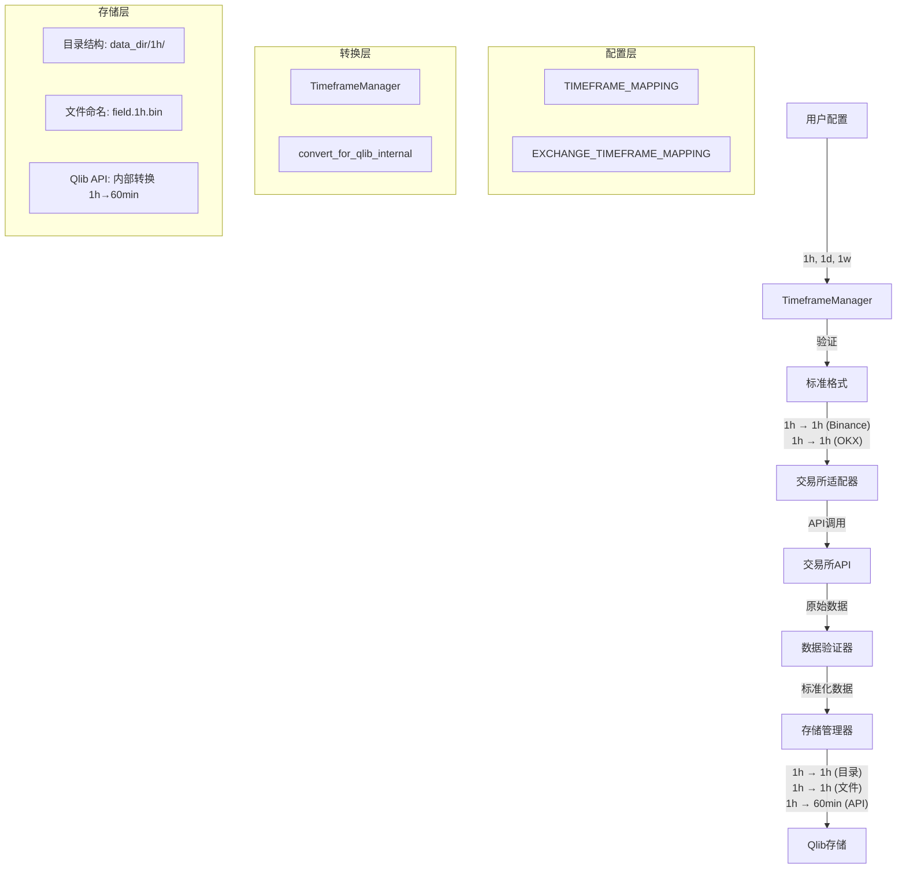

# Timeframe 技术参考

## 📖 系统架构

### 设计原则

1. **统一命名规范**：与 Qlib 项目其他数据收集器保持一致
2. **边界分离**：严格区分用户接口和内部实现
3. **最小转换**：仅在必要时进行格式转换
4. **Qlib 兼容性**：确保与 Qlib 存储系统完全兼容

### 架构流程图



## 🏗️ 核心组件

### 1. TimeframeManager

**职责**：提供 timeframe 验证、交易所格式转换等核心功能

```python
class TimeframeManager:
    def validate_timeframe(self, timeframe: str) -> bool
    def validate_timeframes(self, timeframes: List[str]) -> List[str]
    def get_exchange_timeframe(self, exchange: str, timeframe: str) -> str
    def get_common_timeframes(self, exchanges: List[str]) -> List[str]
    def get_timeframes_by_category(self, category: str) -> List[str]
```

**设计特点**：
- 简化的API，移除了过度工程化的功能
- 基于映射表的转换，性能优异
- 完全无状态，线程安全

### 2. 核心配置映射

```python
# 标准格式定义
TIMEFRAME_MAPPING = {
    "1min": "1min",
    "5min": "5min", 
    "15min": "15min",
    "30min": "30min",
    "1h": "1h",
    "1d": "1d",
    "1w": "1w",
}

# 交易所格式转换
EXCHANGE_TIMEFRAME_MAPPING = {
    "binance": {
        "1min": "1m",
        "5min": "5m",
        "1h": "1h",
        "1d": "1d",
        "1w": "1w",
    },
    "okx": {
        "1min": "1m",
        "5min": "5m", 
        "1h": "1h",    # 保持小写，注意：不是 1H！
        "1d": "1d",    # 保持小写，注意：不是 1D！
        "1w": "1w",    # 保持小写，注意：不是 1W！
    },
}
```

**⚠️ 重要提醒：OKX 格式说明**
```
OKX 使用小写格式 (1h, 1d, 1w)，不是大写 (1H, 1D, 1W)！
这是一个常见的错误假设。许多开发者认为 OKX 使用大写格式，
但实际上 OKX API 要求小写格式。

正确: "1h", "1d", "1w"
错误: "1H", "1D", "1W"

使用错误格式会导致 "Timeframe not supported" 错误。
```

### 3. 边界函数：convert_for_qlib_internal

**关键边界规则**：

**✅ 允许使用的模块**：
- `storage_manager.py` - 调用 Qlib 存储 API 时
- `qlib_data_generator.py` - 创建 Qlib 存储对象时

**❌ 禁止使用的场景**：
- 用户 API、配置处理、数据收集、文件命名
- 任何用户可见的接口

```python
def convert_for_qlib_internal(timeframe: str) -> str:
    """
    仅在 Qlib 存储API 调用时使用
    
    CRITICAL: 这个函数存在的原因是 Qlib 的 FileFeatureStorage 等类
    期望特定的格式。这不是设计缺陷，而是必要的兼容性要求。
    """
    if timeframe == "1h":
        return "60min"  # Qlib 存储API要求
    return timeframe    # 其他格式保持不变
```

### 4. Pandas频率映射：timeframe_to_pandas_freq

**新增功能**：统一的 pandas 频率转换函数

**使用场景**：
- ✅ 创建 pandas DatetimeIndex (`pd.date_range()`)
- ✅ 数据重采样 (`DataFrame.resample()`)  
- ✅ 时间序列数据处理和分析
- ✅ 生成合成时间戳用于测试/验证
- ✅ 日历生成（使用pandas功能时）

**不适用场景**：
- ❌ Qlib 内部存储操作（使用 `convert_for_qlib_internal` 代替）
- ❌ 交易所 API 时间框架参数（使用 `EXCHANGE_TIMEFRAME_MAPPING`）
- ❌ 文件/目录命名（使用原始时间框架字符串）

```python
def timeframe_to_pandas_freq(timeframe: str) -> str:
    """
    将标准时间框架格式转换为 pandas 频率字符串
    
    参数
    ----
    timeframe : str
        标准时间框架格式 (如 "1min", "5min", "1h", "1d", "1w")
        
    返回
    ----
    str
        Pandas 频率字符串，兼容 pd.date_range(), DataFrame.resample() 等
        
    示例
    ----
    >>> timeframe_to_pandas_freq("1h")
    '1h'
    >>> timeframe_to_pandas_freq("5min")
    '5min'
    >>> timeframe_to_pandas_freq("1d")
    '1D'
    
    # 在 pandas 操作中使用:
    >>> freq = timeframe_to_pandas_freq("1h")
    >>> timestamps = pd.date_range(start="2023-01-01", periods=24, freq=freq)
    >>> data.resample(freq).mean()
    """
```

**与其他函数的区别**：

| 函数 | 用途 | 输入示例 | 输出示例 | 使用边界 |
|------|------|----------|----------|----------|
| `timeframe_to_pandas_freq()` | pandas数据处理 | "1h" | "1h" | pandas操作 |
| `convert_for_qlib_internal()` | Qlib存储API | "1h" | "60min" | 仅存储层 |
| `get_exchange_timeframe()` | 交易所API | "1h" | "1h"(Binance) | 数据收集 |

**在存储管理器中的正确使用**：

```python
def save_feature_data(self, data, instrument, field, freq):
    # BOUNDARY: convert_for_qlib_internal usage - ONLY for Qlib storage API
    qlib_freq = convert_for_qlib_internal(freq)
    
    # 使用原始格式进行目录结构
    feature_dir = self.data_dir / freq / "features" / instrument
    feature_file = feature_dir / f"{field}.{freq}.bin"
    
    # 使用转换格式调用 Qlib API
    storage = FileFeatureStorage(
        freq=qlib_freq,  # 转换格式仅用于 Qlib API
        provider_uri={qlib_freq: str(self.data_dir / freq)}
    )
```

## 🔧 开发任务指南

### 添加新 Timeframe 支持

**步骤 1：更新核心映射**

```python
# config/timeframes.py
TIMEFRAME_MAPPING = {
    # 现有映射...
    "2h": "2h",      # 新增
    "4h": "4h",      # 新增
}
```

**步骤 2：添加交易所映射**

```python
EXCHANGE_TIMEFRAME_MAPPING = {
    "binance": {
        # 现有映射...
        "2h": "2h",
        "4h": "4h",
    },
    "okx": {
        # 现有映射...
        "2h": "2h",    # 注意：OKX 使用小写！
        "4h": "4h",    # 注意：OKX 使用小写！
    },
}
```

**步骤 3：检查 Qlib 兼容性**

```python
# 如果新格式需要特殊转换，更新 convert_for_qlib_internal
def convert_for_qlib_internal(timeframe: str) -> str:
    if timeframe == "1h":
        return "60min"
    elif timeframe == "2h":
        return "120min"  # 如果 Qlib 要求分钟格式
    return timeframe
```

### 添加新交易所支持

**步骤 1：研究交易所 API 格式**

```python
# 分析目标交易所的时间间隔格式
# 例如：Coinbase Pro 使用 60, 300, 900, 3600, 21600, 86400
```

**步骤 2：创建映射表**

```python
EXCHANGE_TIMEFRAME_MAPPING = {
    # 现有交易所...
    "coinbase": {
        "1min": "60",      # 秒为单位
        "5min": "300",
        "15min": "900",
        "1h": "3600",
        "1d": "86400",
    },
}
```

**步骤 3：实现转换函数**

```python
def get_exchange_timeframe(exchange: str, timeframe: str) -> str:
    if exchange not in EXCHANGE_TIMEFRAME_MAPPING:
        raise ValueError(f"Unsupported exchange: {exchange}")
    
    mapping = EXCHANGE_TIMEFRAME_MAPPING[exchange]
    if timeframe not in mapping:
        raise ValueError(f"Unsupported timeframe {timeframe} for {exchange}")
    
    return mapping[timeframe]
```

## 💻 代码示例

### 基本验证和转换

```python
from config.timeframes import validate_timeframe, get_exchange_timeframe, timeframe_to_pandas_freq

# 验证单个timeframe
print(validate_timeframe("1h"))     # True
print(validate_timeframe("1d"))     # True
print(validate_timeframe("invalid")) # False

# 交易所格式转换
binance_1h = get_exchange_timeframe("binance", "1h")
print(f"Binance 1h: {binance_1h}")  # 输出: 1h

binance_1min = get_exchange_timeframe("binance", "1min")
print(f"Binance 1min: {binance_1min}")  # 输出: 1m

# OKX 格式转换 (重要：OKX 使用小写格式！)
okx_1h = get_exchange_timeframe("okx", "1h")
print(f"OKX 1h: {okx_1h}")  # 输出: 1h

okx_1d = get_exchange_timeframe("okx", "1d")
print(f"OKX 1d: {okx_1d}")  # 输出: 1d

# Pandas 频率转换 (新增功能)
pandas_1h = timeframe_to_pandas_freq("1h")
print(f"Pandas 1h: {pandas_1h}")  # 输出: 1h

pandas_5min = timeframe_to_pandas_freq("5min")
print(f"Pandas 5min: {pandas_5min}")  # 输出: 5min
```

### Pandas 数据处理示例

```python
import pandas as pd
from config.timeframes import timeframe_to_pandas_freq

# 创建时间序列数据
timeframe = "1h"
freq = timeframe_to_pandas_freq(timeframe)

# 生成时间戳
timestamps = pd.date_range(
    start="2023-01-01", 
    end="2023-01-02", 
    freq=freq
)
print(f"生成了 {len(timestamps)} 个 {timeframe} 时间戳")

# 创建示例数据
import numpy as np
data = pd.DataFrame({
    'price': np.random.randn(len(timestamps)) + 100,
    'volume': np.random.randint(1000, 5000, len(timestamps))
}, index=timestamps)

# 数据重采样 - 从小时数据生成日数据
daily_freq = timeframe_to_pandas_freq("1d")
daily_data = data.resample(daily_freq).agg({
    'price': 'mean',
    'volume': 'sum'
})

print(f"原始数据: {len(data)} 条记录")
print(f"重采样后: {len(daily_data)} 条记录")

# 数据验证中的时间戳生成
def generate_test_timestamps(timeframe: str, num_records: int):
    """为数据验证生成测试时间戳"""
    freq = timeframe_to_pandas_freq(timeframe)
    return pd.date_range(
        end=pd.Timestamp.now().normalize(),
        periods=num_records,
        freq=freq
    )

# 使用示例
test_timestamps = generate_test_timestamps("1h", 100)
print(f"生成了 100 个小时级别的测试时间戳")
```

### 使用 TimeframeManager

```python
from timeframe_manager import TimeframeManager

# 创建管理器实例
manager = TimeframeManager()

# 验证timeframes列表
timeframes = ["1h", "1d", "invalid", "1w"]
valid_timeframes = manager.validate_timeframes(timeframes)
print(f"有效的timeframes: {valid_timeframes}")
# 输出: ['1h', '1d', '1w']

# 获取多个交易所的共同timeframes
exchanges = ["binance", "okx"]
common_timeframes = manager.get_common_timeframes(exchanges)
print(f"共同支持的timeframes: {common_timeframes}")
```

### 数据收集

```python
from collector import CryptoCollector

# 基本数据收集
collector = CryptoCollector(
    exchanges=["binance"],
    timeframes=["1h", "1d"],
    symbols=["BTC/USDT", "ETH/USDT"]
)
collector.collect_data()

# 多交易所数据收集
collector = CryptoCollector(
    exchanges=["binance", "okx"],
    timeframes=["1h", "1d"],
    symbols=["BTC/USDT", "ETH/USDT"]
)
collector.collect_data()
```

### 存储管理

```python
from storage_manager import CryptoStorageManager

# 创建存储管理器
storage_manager = CryptoStorageManager(
    data_dir="./crypto_data",
    create_dirs=True
)

# 保存数据（内部会自动处理Qlib格式转换）
storage_manager.save_feature_data(
    data=price_data,
    instrument="binance_spot_btc_usdt",
    field="close",
    freq="1h"  # 使用原始格式，存储管理器内部处理转换
)

# 读取数据
data = storage_manager.load_feature_data(
    instrument="binance_spot_btc_usdt",
    field="close",
    freq="1h"  # 使用原始格式
)
```

## 🧪 测试策略

### 单元测试

```python
def test_timeframe_validation():
    assert validate_timeframe("1h") == True
    assert validate_timeframe("invalid") == False

def test_exchange_conversion():
    assert get_exchange_timeframe("binance", "1h") == "1h"
    assert get_exchange_timeframe("okx", "1h") == "1h"

def test_qlib_boundary():
    # 测试边界函数
    assert convert_for_qlib_internal("1h") == "60min"
    assert convert_for_qlib_internal("1d") == "1d"
```

### 集成测试

```python
def test_end_to_end_flow():
    # 测试完整流程：配置 → 验证 → 转换 → 存储
    timeframes = ["1h", "1d"]
    manager = TimeframeManager()
    
    # 验证
    valid_timeframes = manager.validate_timeframes(timeframes)
    assert valid_timeframes == timeframes
    
    # 交易所转换
    binance_tf = manager.get_exchange_timeframe("binance", "1h")
    assert binance_tf == "1h"
    
    # 存储测试
    storage_manager = CryptoStorageManager("./test_data")
    # 测试实际存储操作...
```

### 边界测试

```python
def test_boundary_violations():
    """测试边界违规检测"""
    with pytest.warns(UserWarning, match="BOUNDARY VIOLATION"):
        # 模拟从错误模块调用
        convert_for_qlib_internal("1h")
```

## ⚡ 性能优化

### 缓存策略

```python
class TimeframeManager:
    def __init__(self):
        self._validation_cache = {}
        self._exchange_cache = {}
    
    def validate_timeframe(self, timeframe: str) -> bool:
        if timeframe not in self._validation_cache:
            self._validation_cache[timeframe] = timeframe in TIMEFRAME_MAPPING
        return self._validation_cache[timeframe]
```

### 批量操作优化

```python
def validate_timeframes(self, timeframes: List[str]) -> List[str]:
    """批量验证比逐个验证更高效"""
    valid_set = set(TIMEFRAME_MAPPING.keys())
    return [tf for tf in timeframes if tf in valid_set]
```

## ⚠️ 常见开发陷阱

### 1. 边界违规

```python
# ❌ 错误：在用户 API 中使用内部转换
def user_api(timeframe: str):
    converted = convert_for_qlib_internal(timeframe)  # 违规！
    return {"timeframe": converted}

# ✅ 正确：用户 API 使用原始格式
def user_api(timeframe: str):
    if not validate_timeframe(timeframe):
        raise ValueError(f"Invalid timeframe: {timeframe}")
    return {"timeframe": timeframe}
```

### 2. 文件命名错误

```python
# ❌ 错误：文件名使用转换格式
def create_file_path(timeframe: str, field: str):
    converted = convert_for_qlib_internal(timeframe)
    return f"{field}.{converted}.bin"  # 错误！

# ✅ 正确：文件名使用原始格式
def create_file_path(timeframe: str, field: str):
    return f"{field}.{timeframe}.bin"  # 正确！
```

### 3. OKX 格式错误

```python
# ❌ 错误：假设 OKX 使用大写格式
okx_mapping = {
    "1h": "1H",  # 错误！
    "1d": "1D",  # 错误！
}

# ✅ 正确：OKX 使用小写格式
okx_mapping = {
    "1h": "1h",  # 正确！
    "1d": "1d",  # 正确！
}
```

## 📊 存储结构详解

### 统一的文件系统结构

```
crypto_data/
├── 1min/                        # 分钟级数据
│   ├── features/
│   │   ├── binance_spot_btc_usdt/
│   │   │   ├── open.1min.bin
│   │   │   ├── high.1min.bin
│   │   │   ├── low.1min.bin
│   │   │   ├── close.1min.bin
│   │   │   └── volume.1min.bin
│   │   └── binance_spot_eth_usdt/
│   │       └── ...
│   ├── instruments/
│   │   └── crypto.txt
│   └── calendars/
│       └── crypto.txt
├── 1h/                          # 小时级数据
│   ├── features/
│   ├── instruments/
│   └── calendars/
└── 1d/                          # 日级数据
    ├── features/
    ├── instruments/
    └── calendars/
```

**关键特点:**
- 目录名使用 timeframe 格式 (`1h/`, `1d/`)
- 文件名使用 timeframe 格式 (`close.1h.bin`)
- 完全一致，没有混合格式

## 🔍 故障排查

### 常见错误和解决方案

```python
# 1. 格式验证
def debug_timeframe_issues():
    problematic_timeframes = ["hour", "1m", "day", "1H"]
    
    for tf in problematic_timeframes:
        if not validate_timeframe(tf):
            print(f"❌ '{tf}' 不是有效格式")
            # 建议正确格式
            suggestions = {
                "hour": "1h",
                "1m": "1min", 
                "day": "1d",
                "1H": "1h"  # OKX 不使用大写！
            }
            if tf in suggestions:
                print(f"   建议使用: '{suggestions[tf]}'")

# 2. 交易所兼容性检查
def check_exchange_compatibility(exchange: str, timeframes: List[str]):
    supported = get_supported_timeframes_for_exchange(exchange)
    
    for tf in timeframes:
        if tf not in supported:
            print(f"❌ {exchange} 不支持 {tf}")
        else:
            converted = get_exchange_timeframe(exchange, tf)
            print(f"✅ {exchange}: {tf} → {converted}")

# 3. 边界检查
def check_boundary_usage():
    """检查是否有边界违规"""
    import warnings
    with warnings.catch_warnings(record=True) as w:
        warnings.simplefilter("always")
        
        # 这里会触发警告（如果在错误地方调用）
        convert_for_qlib_internal("1h")
        
        if w:
            print("⚠️ 检测到边界违规:")
            for warning in w:
                print(f"   {warning.message}")
```

## 📈 监控和维护

### 性能监控

```python
import time
from functools import wraps

def monitor_performance(func):
    @wraps(func)
    def wrapper(*args, **kwargs):
        start = time.time()
        result = func(*args, **kwargs)
        duration = time.time() - start
        
        if duration > 0.1:  # 100ms threshold
            print(f"⚠️ 慢操作: {func.__name__} 耗时 {duration:.3f}s")
        
        return result
    return wrapper

# 应用到关键函数
@monitor_performance
def get_exchange_timeframe(exchange: str, timeframe: str) -> str:
    # ... 实现
```

### 健康检查

```python
def system_health_check() -> Dict[str, Any]:
    """系统健康检查"""
    health = {
        "timeframe_mapping": len(TIMEFRAME_MAPPING),
        "exchange_mapping": len(EXCHANGE_TIMEFRAME_MAPPING),
        "status": "healthy"
    }
    
    # 验证核心映射完整性
    for exchange, mapping in EXCHANGE_TIMEFRAME_MAPPING.items():
        missing = set(TIMEFRAME_MAPPING.keys()) - set(mapping.keys())
        if missing:
            health[f"{exchange}_missing_timeframes"] = list(missing)
            health["status"] = "warning"
    
    return health
```

## 📋 最佳实践总结

1. **边界分离**：严格控制 `convert_for_qlib_internal` 的使用范围
2. **格式统一**：用户侧始终使用标准格式（1h, 1d, 1w）
3. **OKX 注意**：记住 OKX 使用小写格式，不是大写
4. **性能优化**：使用缓存和批量操作
5. **错误处理**：提供清晰的错误信息和解决建议
6. **测试覆盖**：包含单元测试、集成测试和边界测试
7. **监控维护**：定期检查系统健康状态和性能指标

通过遵循这些指导原则和最佳实践，开发者可以安全有效地扩展和维护 timeframe 系统，同时确保与整个 Qlib 生态系统的兼容性。