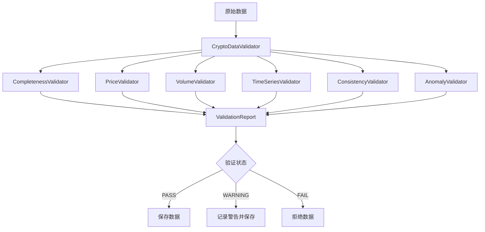

# 加密货币数据验证器文档

## 概述

本目录包含了加密货币数据收集模块的完整验证系统。验证系统采用分层架构，通过多个专门的验证器确保数据质量，为Qlib策略提供可靠的数据基础。

## 🏗️ 架构设计

### 核心组件

```
validators/
├── base_validator.py          # 基础验证器抽象类
├── data_validator.py          # 主验证器协调器
├── completeness_validator.py  # 数据完整性验证
├── price_validator.py         # 价格数据验证
├── volume_validator.py        # 成交量数据验证
├── timeseries_validator.py    # 时间序列验证
├── consistency_validator.py   # 数据一致性验证
├── anomaly_validator.py       # 异常检测验证
└── README.md                  # 本文档
```

### 验证流程



## 📋 验证器详解

### 1. CompletenessValidator - 数据完整性验证

**功能**: 验证数据的基本完整性和结构正确性

**检查项目**:
- 必需字段存在性检查
- 数据行数验证
- 缺失值比例检查
- 数据类型验证

**配置参数**:
```yaml
required_fields: ["open", "high", "low", "close", "volume"]
optional_fields: ["volume_24h", "funding_rate", "change_24h"]
max_missing_ratio: 0.05  # 5%最大缺失率
min_rows: 10
```

**失败后果**:
- 数据为空 → `CRITICAL`错误
- 缺失必需字段 → `ERROR`级别
- 缺失率超标 → `WARNING`级别

### 2. PriceValidator - 价格数据验证

**功能**: 验证OHLC价格数据的合理性和一致性

**检查项目**:
- OHLC关系验证 (High ≥ Open/Close, Low ≤ Open/Close)
- 价格正值检查
- 价格变化幅度检查
- 价格异常值检测

**配置参数**:
```yaml
max_price_change_pct: 30.0  # 30%最大价格变化
price_outlier_threshold: 3.0  # Z-score阈值
min_price: 0.0
```

**失败后果**:
- OHLC关系错误 → `ERROR`级别
- 价格变化过大 → `WARNING`级别
- 负价格 → `ERROR`级别

### 3. VolumeValidator - 成交量数据验证

**功能**: 验证成交量数据的合理性

**检查项目**:
- 成交量非负性检查
- 零成交量比例验证
- 成交量异常值检测
- 成交量数据类型检查

**配置参数**:
```yaml
volume_outlier_threshold: 4.0
min_volume: 0.0
max_zero_volume_ratio: 0.02  # 2%最大零成交量比例
```

**失败后果**:
- 负成交量 → `ERROR`级别
- 零成交量比例过高 → `WARNING`级别
- 成交量异常值 → `WARNING`级别

### 4. TimeSeriesValidator - 时间序列验证

**功能**: 验证时间戳的连续性和一致性

**检查项目**:
- 时间戳排序检查
- 重复时间戳检测
- 时间间隔一致性验证
- 缺失时间段检测

**配置参数**:
```yaml
expected_interval_seconds: 3600  # 1小时
max_missing_periods_ratio: 0.03  # 3%最大缺失周期
allow_duplicate_timestamps: false
```

**失败后果**:
- 重复时间戳 → `ERROR`级别
- 时间戳乱序 → `ERROR`级别
- 缺失周期过多 → `WARNING`级别

### 5. ConsistencyValidator - 数据一致性验证

**功能**: 验证字段间的逻辑关系和加密货币特有字段

**检查项目**:
- OHLC数据一致性
- 成交量一致性
- 加密货币特有字段验证 (资金费率、24小时变化等)
- 跨字段关系验证

**配置参数**:
```yaml
consistency_tolerance: 0.01  # 1%容差
funding_rate_range: [-0.01, 0.01]  # 资金费率范围
change_24h_range: [-100.0, 1000.0]  # 24小时变化范围
```

**失败后果**:
- 数据类型不一致 → `ERROR`级别
- 资金费率超出范围 → `WARNING`级别
- 24小时变化异常 → `WARNING`级别

### 6. AnomalyValidator - 异常检测验证

**功能**: 使用统计方法检测数据异常

**检查项目**:
- Z-score异常检测
- IQR (四分位距) 异常检测
- 价格突增检测
- 成交量突增检测

**配置参数**:
```yaml
anomaly_z_score_threshold: 3.0
anomaly_iqr_multiplier: 1.5
price_spike_threshold: 0.15  # 15%价格突增
volume_spike_threshold: 4.0  # 4倍成交量突增
```

**失败后果**:
- 统计异常 → `WARNING`级别
- 价格突增 → `WARNING`级别
- 成交量突增 → `WARNING`级别

## 🔧 使用方法

### 基本使用

```python
from data_validator import CryptoDataValidator
import pandas as pd

# 初始化验证器
validator = CryptoDataValidator()

# 验证数据
data = pd.DataFrame(...)  # 你的数据
report = validator.validate(data, symbol="BTC/USDT", timeframe="1h")

# 检查结果
print(f"验证状态: {report.overall_status}")
print(f"错误数量: {report.total_errors}")
print(f"警告数量: {report.total_warnings}")
```

### 自定义配置

```python
from config.validation_config import ValidationConfig

# 创建严格配置
strict_config = ValidationConfig.create_strict_config()
validator = CryptoDataValidator(config=strict_config)

# 或者自定义配置
custom_config = ValidationConfig(
    max_price_change_pct=20.0,
    max_missing_ratio=0.02,
    enable_anomaly_detection=False
)
validator = CryptoDataValidator(config=custom_config)
```

### 批量验证

```python
# 批量验证多个币种
data_batch = {
    "BTC/USDT": btc_data,
    "ETH/USDT": eth_data,
    "BNB/USDT": bnb_data
}

reports = validator.validate_batch(data_batch, timeframe="1h")

for symbol, report in reports.items():
    print(f"{symbol}: {report.overall_status}")
```

## ⚠️ 验证级别和处理策略

### 严重级别

1. **INFO**: 信息性消息，不影响数据质量
2. **WARNING**: 可疑但可接受的数据，记录但不阻止保存
3. **ERROR**: 明确的数据质量问题，可能阻止数据保存
4. **CRITICAL**: 严重错误，数据不可用，必须阻止保存

### 验证状态

- **PASS**: 所有验证通过，数据质量良好
- **WARNING**: 有警告但无错误，数据可用但需关注
- **FAIL**: 有错误或严重问题，数据不应使用

### 处理策略

```python
def handle_validation_result(report):
    if report.overall_status == "PASS":
        # 保存数据
        save_data(data)
    elif report.overall_status == "WARNING":
        # 记录警告并保存
        log_warnings(report)
        save_data(data)
    else:  # FAIL
        # 拒绝数据，记录错误
        log_errors(report)
        reject_data(data)
```

## 📊 配置模板

### 标准配置 (btcdom2_core.yaml)

适用于核心币种的标准验证配置：

```yaml
validation:
  enabled: true
  enable_price_validation: true
  enable_volume_validation: true
  enable_timeseries_validation: true
  enable_consistency_validation: true
  enable_anomaly_detection: true
  
  # 核心币种严格验证
  core_symbols_strict: true
  core_symbols: ["BTC/USDT", "ETH/USDT", "BNB/USDT", "TRX/USDT", "DOGE/USDT"]
  
  # 数据完整性
  required_fields: ["open", "high", "low", "close", "volume"]
  optional_fields: ["volume_24h", "funding_rate", "change_24h"]
  max_missing_ratio: 0.05
  min_rows: 10
  
  # 价格验证
  max_price_change_pct: 30.0
  price_outlier_threshold: 3.0
  min_price: 0.0
  
  # 成交量验证
  volume_outlier_threshold: 4.0
  min_volume: 0.0
  max_zero_volume_ratio: 0.02
  
  # 时间序列验证
  expected_interval_seconds: 3600
  max_missing_periods_ratio: 0.03
  allow_duplicate_timestamps: false
  
  # 一致性验证
  consistency_tolerance: 0.01
  funding_rate_range: [-0.01, 0.01]
  change_24h_range: [-100.0, 1000.0]
  
  # 异常检测
  anomaly_z_score_threshold: 3.0
  anomaly_iqr_multiplier: 1.5
  price_spike_threshold: 0.15
  volume_spike_threshold: 4.0
  min_data_points_for_anomaly: 30
```

## 🔍 故障排除

### 常见问题

1. **验证器导入错误**
   ```
   解决方案: 确保Python路径包含crypto模块目录
   export PYTHONPATH="${PYTHONPATH}:/path/to/scripts/data_collector/crypto"
   ```

2. **配置文件加载失败**
   ```
   解决方案: 检查YAML文件格式和路径
   ```

3. **验证性能问题**
   ```
   解决方案: 
   - 减少数据量进行批量验证
   - 禁用不必要的验证器
   - 调整异常检测参数
   ```

### 调试技巧

```python
# 启用详细日志
import logging
logging.basicConfig(level=logging.DEBUG)

# 单独测试验证器
from validators.price_validator import PriceValidator
price_validator = PriceValidator()
result = price_validator.validate(data)
print(result.issues)

# 查看验证统计信息
for result in report.results:
    print(f"{result.validator_name}: {result.statistics}")
```

## 📈 性能优化

### 批量处理优化

- 使用 `validate_batch()` 方法处理多个币种
- 合理设置批量大小，避免内存溢出
- 并行处理不同时间框架的数据

### 配置优化

- 根据数据特点调整验证阈值
- 对于历史数据，可以放宽某些验证条件
- 对于实时数据，使用更严格的验证

### 监控和告警

- 定期检查验证报告
- 设置验证失败率告警
- 监控验证器执行时间

---

**注意**: 本验证系统是加密货币数据收集模块的核心组件，确保数据质量对策略的成功至关重要。建议在生产环境中定期审查和调整验证配置。
